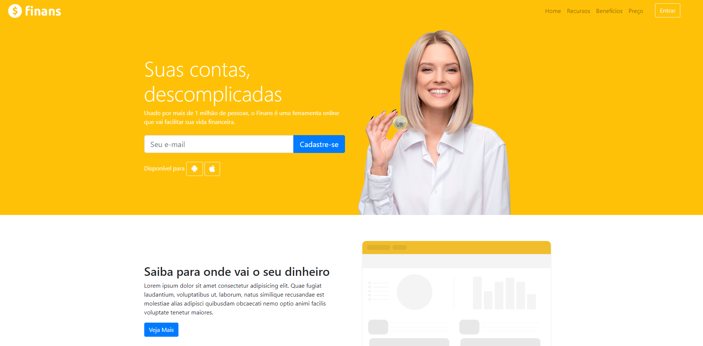

<h1>Projeto Finans - Finanças pessoais</h1>

O projeto <strong>Finans</strong> foi desenvolvido durante o curso "Desenvolvimento Web 2020" ministrado por  Jorge Sant Ana e Jamilton Damasceno por meio da plataforma de ensino <a href ="https://www.udemy.com/">Udemy.<a>

Este projeto teve como objetivo criar um Front-end utilizando HTML, CSS e Bootstrap para uma página web.

## Tecnologias utilizadas:

  - [HTML](https://www.w3schools.com/html/default.asp)
  - [CSS](https://www.w3schools.com/css/)
  - [Bootstrap](https://getbootstrap.com.br/)

## Front-end

